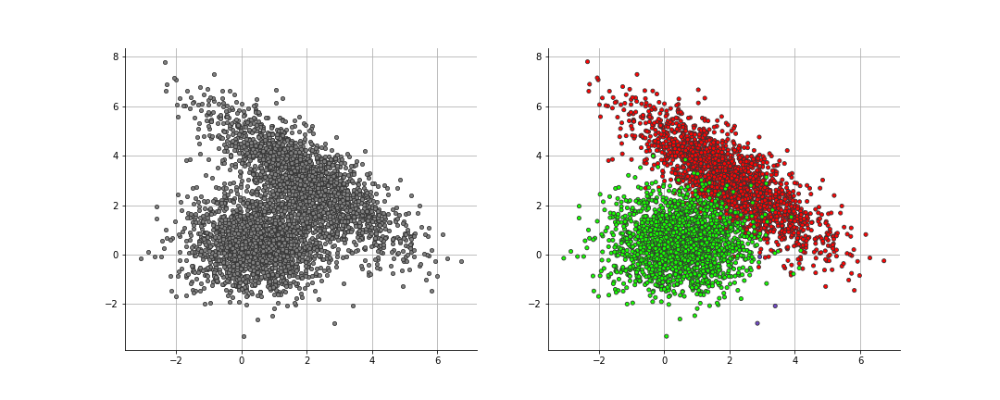

# DisCGS

This code performs the distributed collapsed Gibbs sampler for Dirichlet Process Mixture Model inference.

### Building

The script build.sh is provided to build an executable jar containing all the dependencies. 
Use the following command to build it: 
```
/bin/bash build.sh
```
See src/pom.xml file for Scala and spark dependencies.

### Running 

In order to run the built jar use the following code:

```
scala -J-Xmx1024m target/DisDPMM_2.13-1.0-jar-with-dependencies.jar <dataset name> <number of workers> <number of runs> <compute the log-likelihood>
```

Example of execution:

```
scala -J-Xmx1024m target/DisDPMM_2.13-1.0-jar-with-dependencies.jar EngyTime_4096_2_2 2 1 True
```
The above code will perform  1 run on EngyTime dataset using 2 workers and will compute the log-likelihood.

The datasets used in the paper are provided in dataset file.

The program will output the runtime, ARI, NMI, the number of inferred clusters, and the likelihood if computed:

```
>>>>>> Launch: 0
Runtime: 28.70232966
ARI: 0.9960966096302842
NMI: 0.9883973976898691
Number of inferred clusters: 2
Log-likelihood: -14915.09659745419
```

### Visualization




### Analyse all results

A jupyter notebook is provided to analyse all the results.

Please go to results file and open the notebook AnalyseResults.ipynb and execute the cells to see the results.
